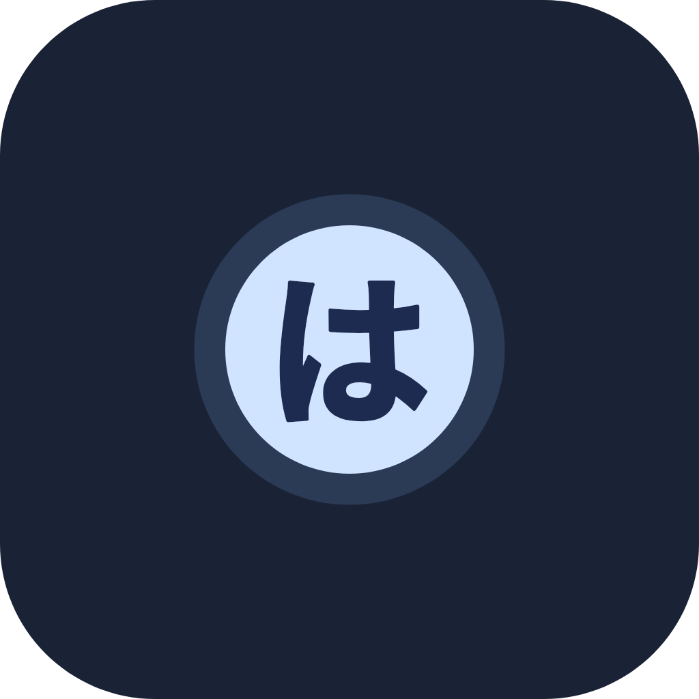

# Han1mePlus

  

基于 Material Design 3 设计语言，使用 Dart & Flutter 构建的 Hanime1 第三方客户端

  
  
  
  
  
  
  
  

## 简介

Han1mePlus 是一个基于 Flutter 开发的 Hanime1 第三方客户端，采用 Material Design 3 设计规范，致力于提供现代化、极度流畅的观看体验。

> 本项目为与 Hanime1 官方无任何关联。

程序支持：

- `Android`
- `Windows`
- `Ios`
- `Macos`

## 下载

前往 [Releases](https://github.com/1wc10086/Han1mePlus/releases/latest) 页面下载最新版。

## 如何贡献

> [!Important]
> **本项目仅由我个人维护，且打算继续保持这种状态。** 

> [!TIP]
> **​在 Issue 中提交建议**： 随时欢迎分享你的想法！

> [!NOTE]
> **分享想法与建议**： 如果你觉得缺少某个功能，或者有什么有意思的想法，欢迎随时新建一个 Issue。

> [!WARNING]
> **​反馈 Bug**： 遇到了应用崩溃或运行异常？请创建一个 Issue 并尽可能提供详细信息，以便我排查和解决问题。

## 现状

ing...

## 开源协议

本项目遵循 [AGPL v3.0](https://github.com/1wc10086/Han1mePlus/blob/main/LICENSE) 协议。

任何人在遵守协议的前提下，均可自由使用、复制、修改与分发本项目。

本项目按 "现状（As-Is）" 提供，作者不对因使用本软件产生的任何问题承担责任。

## 技术栈

- `Dart`
- `Flutter`
- `Material Design 3`

## 鸣谢

[Han1meViewer](https://github.com/misaka10032w/Han1meViewer)

一个优秀的开源项目，为本项目提供了参考与灵感。

如果这个项目对你有帮助，欢迎点亮 Star ⭐
